*************************************
Fetures and Use Cases of our software
*************************************

1. Homepage:
^^^^^^^^^^^^

The homepage contains the ‘Sign in’ and ‘Sign up’ buttons, along with
the number of users that have registered.

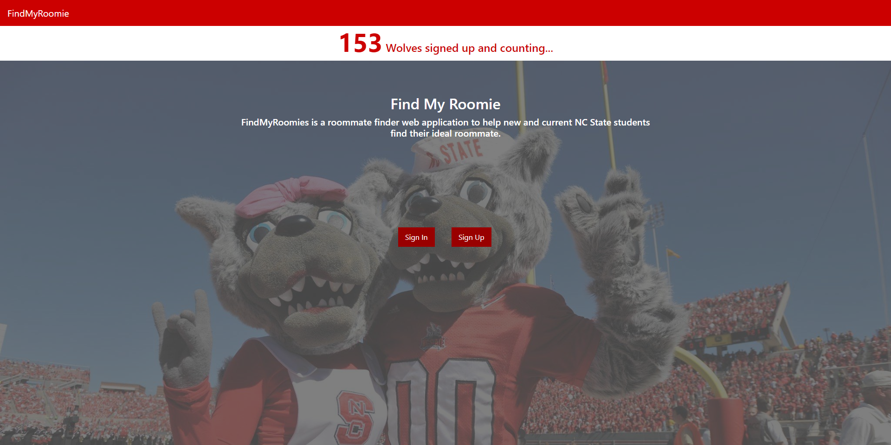

2. SignUp:
^^^^^^^^^^

Allows new users to register to our roommate finding portal. The ‘Sign
up’ page asks to enter an NCSU email id and a suitable password which
should be strong enough.

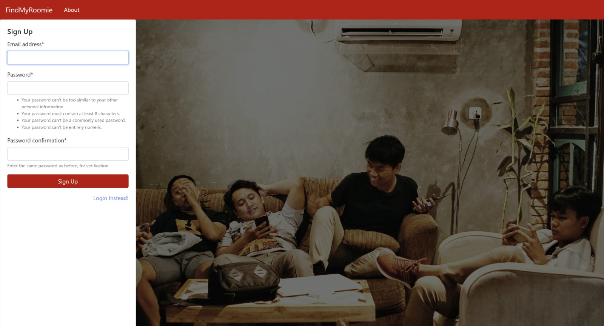

3. Email Confirmation:
^^^^^^^^^^^^^^^^^^^^^^

After entering the credentials for signup, a confirmation email is sent
to the registered mail id, asking to confirm the resgistration. Upon
clicking the link provided in the mail, the account gets confirmed and
the user is directly redirected to the welcome page.

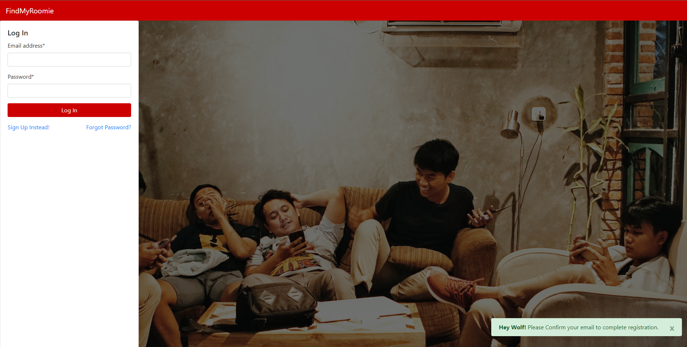

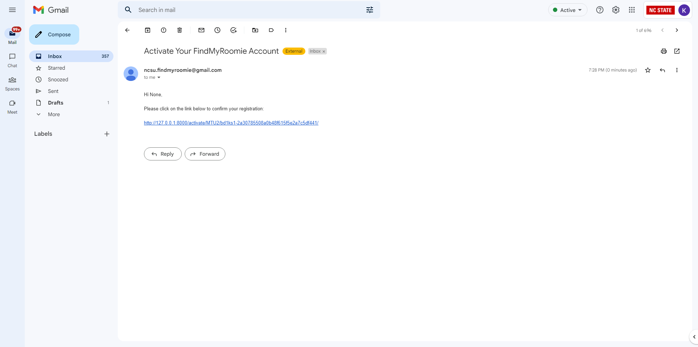

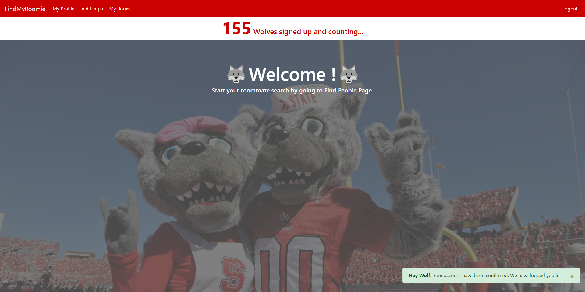

5. SignIn:
^^^^^^^^^^

Allows existing users to login to our website using their credentials.

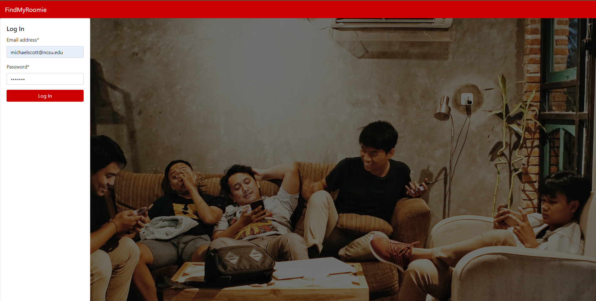

6. Resetting your password:
^^^^^^^^^^^^^^^^^^^^^^^^^^^

In case the user forgets the password, they can enter their registered
email id in the ‘Forgot your passoword?’ tab. An email with a link to
set a new password will be sent to the email. Clicking the link will
redirect the user to reset their password, and, tada! Password reset!!!

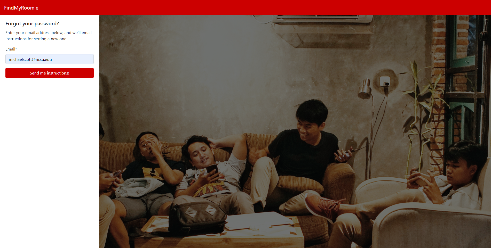

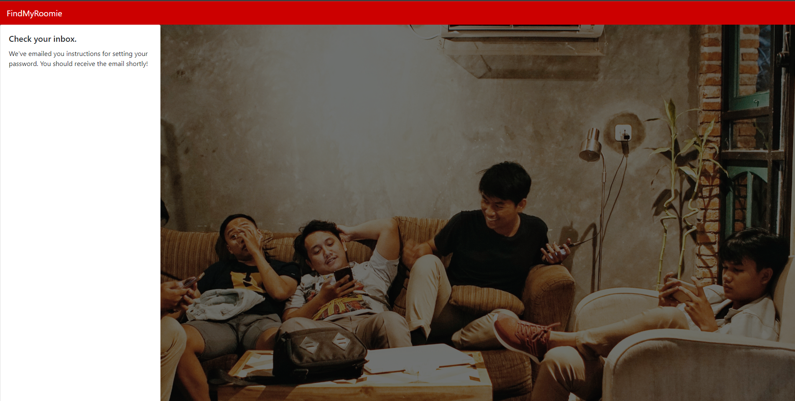

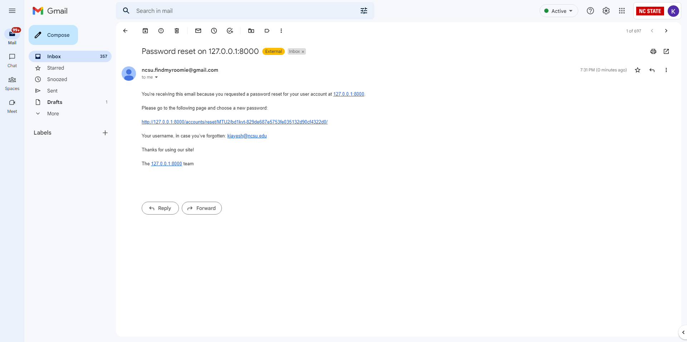

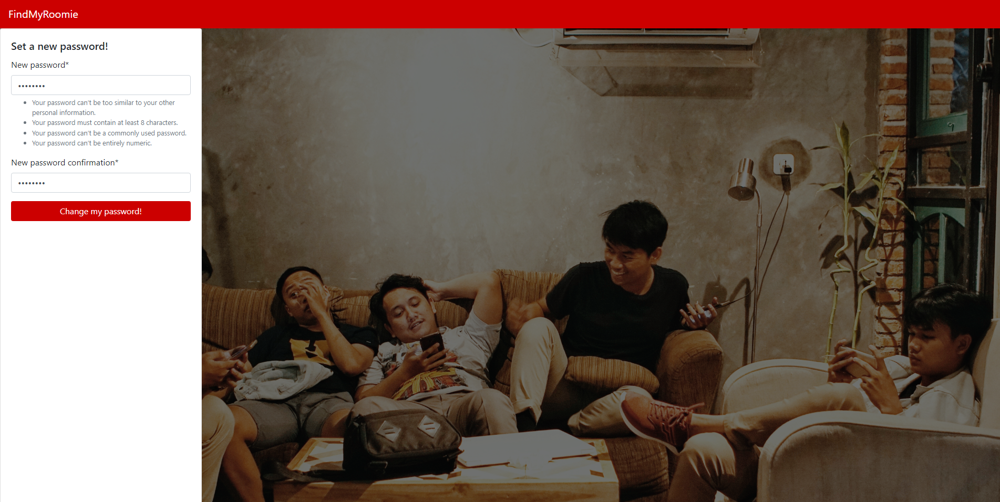

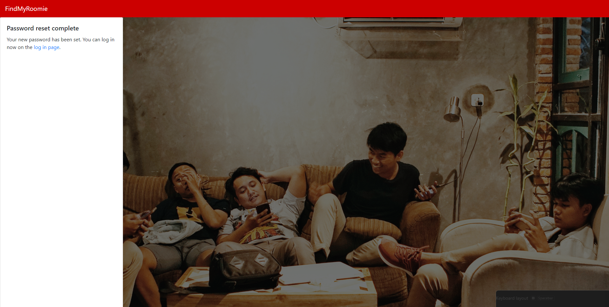

7. Welcome page:
^^^^^^^^^^^^^^^^

A page with happy Mr. and Mrs. Wolf enjoying each other’s company in the
background, just like you and your roommates would be.

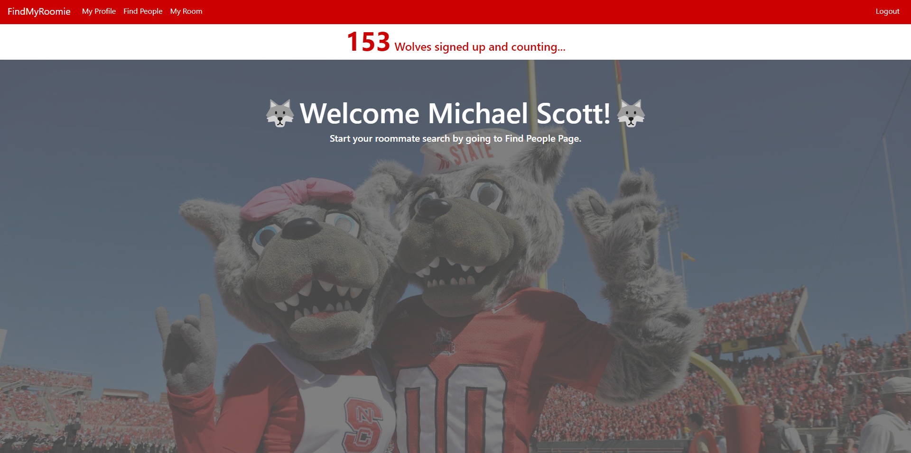

8. My Profile:
^^^^^^^^^^^^^^

Allows you to introduce whom you are to your future roommate! You are
given the opportunity to tell others a little bit about yourself and
your preferences. The “Visibility” checkbox in your profile allows you
to choose whether you want to be visible to others. If you are looking
for roommates, you can toggle it on, and if you have found one
(Congratulations :partying_face: :partying_face:), you can toggle it
off. It’s that easy!

.. image::profile.png
  :width: 600

9. Find people:
^^^^^^^^^^^^^^^

Lists the people looking for roommates just like you. Our “Wolf Filter”
lets you filter candidates based on your preferences. Be choosy!!

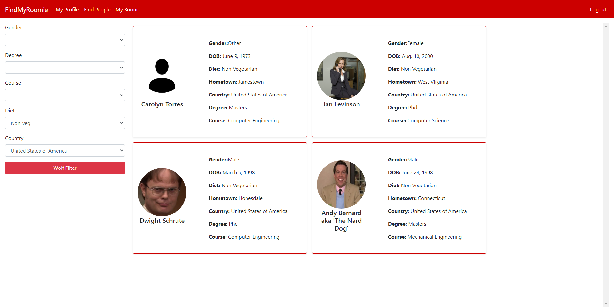

10. My room:
^^^^^^^^^^^^

Lists your roommates (feature not available yet) and provides roommate
suggestions based on your preferences. The similarity scores with other
roommate seekers are calculated based on Manhattan Distance, and the
people with the top scores are shown as suggestions.

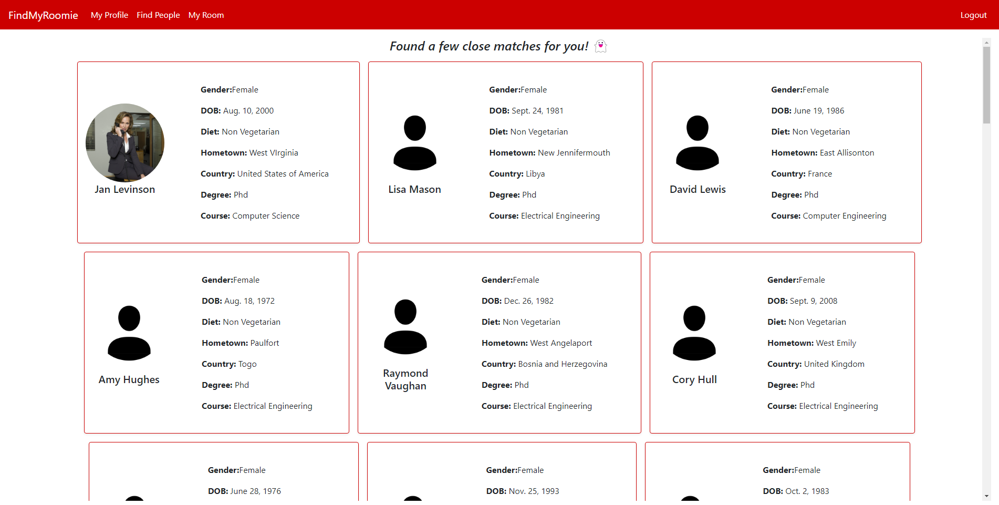

11. About:
^^^^^^^^^^
Elaborates about the project and provides details about the contributors along with a link to our documentation.

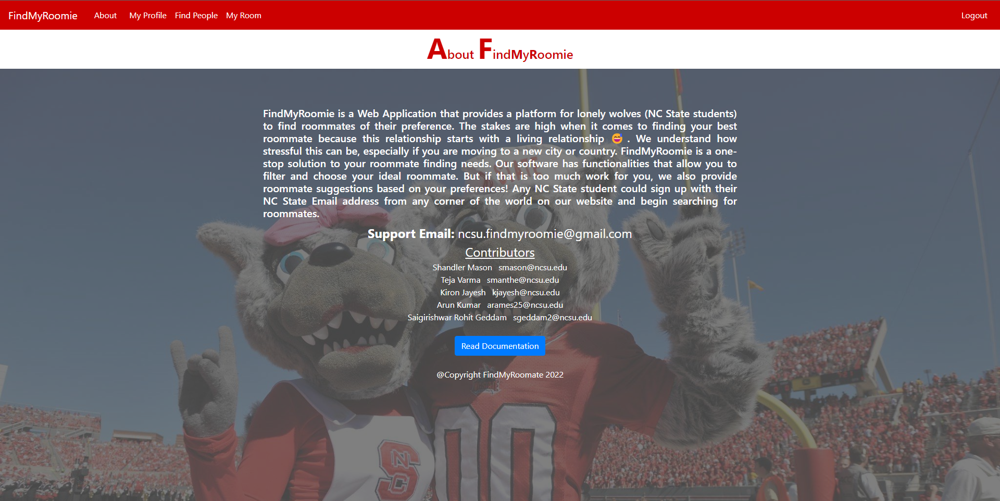
